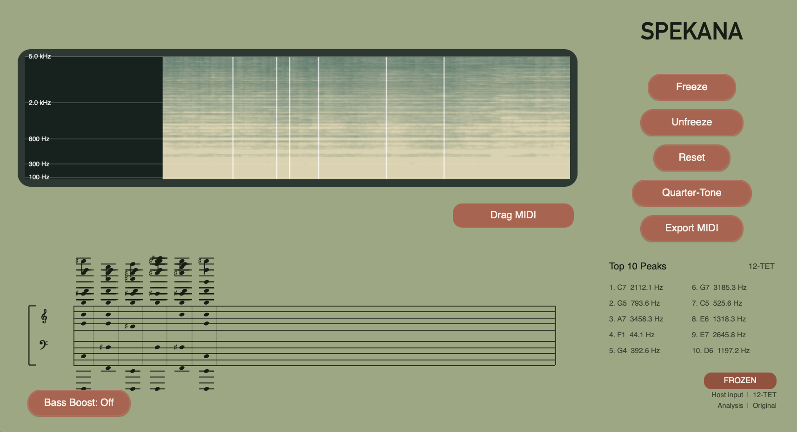

# SPEKANA

`SPEKANA` is a JUCE-based audio analysis plugin focused on live spectrogram display, peak-based pitch tracking, freeze-to-score capture, and MIDI export.

It is artistically inspired by spectralist composers and by ways of listening that treat sound as evolving frequency material rather than only as conventional melody or harmony.

One of its main intentions is to transform textured sound into usable MIDI material that can then be dragged into another track to build harmony, brought into notation software such as Sibelius for compositional work, or used simply as a form of close spectral analysis.

## Interface

Add a main UI screenshot at:

`docs/spekana-ui.png`

Once that file is present in the repo, this image block will render on GitHub and in most markdown viewers:

```md

```

## What It Does

- Live host-audio spectrogram analysis
- Top 10 peak display with note naming
- `12-TET` and `24-TET` display modes
- Quarter-tone notation using arrow accidentals in the score
- `Freeze / Unfreeze / Reset` workflow for capturing chords over time
- Embedded grand-staff score view
- MIDI export from frozen chords
- Live MIDI output from frozen chords
- Optional `Bass Boost` analysis mode

## Aesthetic Direction

`SPEKANA` is intended as an analysis and compositional tool for spectral listening.

It is especially suited to:

- spectral and timbral composition
- texture-based sound materials
- environmental and field recordings
- noisy, unstable, layered, or evolving sound sources

## Recommended Sources

The plugin is not limited to traditional pitched musical input. It can also be very effective with textured material such as:

- rain
- wind
- water
- air noise
- friction sounds
- granular or electronic textures
- bowed, breath-based, or noisy instrumental sounds
- dense mixed materials where pitch and timbre blur together

In other words, the input can be music, non-music, or anything in between, as long as there is spectral detail to listen to and capture.

## Main Workflow

1. Insert the plugin on an audio track.
2. Feed audio from the host into the plugin.
3. Watch the live spectrogram and top-10 detected peaks.
4. Press `Freeze` to capture the current chord.
5. Press `Freeze` again to capture the next chord, or `Unfreeze` to end the current frozen segment.
6. Review the captured notes on the staff.
7. Drag or export MIDI for use on another track.

This workflow is designed not only for transcription, but for re-composition: a texture can become harmonic material, a score sketch, or an analytical trace.

## Pitch / Analysis Behavior

The detector is currently best described as a hybrid spectral peak detector rather than a strict monophonic pitch detector.

- Default mode keeps the original residual/local-peak behavior.
- `Bass Boost` mode adds a low-frequency assist path using zero-padding plus harmonic salience.
- `Bass Boost` is meant to be subtle. It should help bass fundamentals without replacing the original analysis character.

Important note:

- The plugin is strongest on spectral peak discovery and musical annotation.
- It is not a full polyphonic transcription engine.

## Quarter-Tone Behavior

When `Quarter-Tone` is enabled:

- note names are quantized to 24-TET
- score notation uses up/down arrows for quarter-sharp and quarter-flat
- MIDI export/output uses pitch bend for quarter-tone playback

Practical limitation:

- quarter-tone MIDI only sounds correct on instruments that respond to pitch bend
- if a target instrument ignores pitch bend, the notes still play, but they collapse to the nearest 12-TET pitch

## MIDI Output / Export

Frozen chords can be sent out in two ways:

- live MIDI output from the plugin while a frozen chord is active
- exported `.mid` files from the captured chord timeline

Quarter-tone mode uses per-note pitch bend on separate channels where needed.

## UI Notes

- The spectrogram keeps running while you freeze chords.
- Freeze moments are marked in the spectrogram.
- The score is embedded in the main UI.
- `Bass Boost` status is shown both on the button and in the status text.

## Build

This project uses CMake + JUCE.

Example build:

```bash
cmake -S . -B build
cmake --build build --target SPEKANA_VST3
```

Current CMake configuration:

- JUCE is added from `/Users/yifengyuan/desktop/juce`
- plugin formats currently include `AU`, `VST3`, and `Standalone`
- MIDI output is enabled

Main files:

- [CMakeLists.txt](/Users/yifengyuan/Documents/SPEKANA/CMakeLists.txt)
- [PluginProcessor.cpp](/Users/yifengyuan/Documents/SPEKANA/PluginProcessor.cpp)
- [PluginEditor.cpp](/Users/yifengyuan/Documents/SPEKANA/PluginEditor.cpp)

## Install on macOS

Typical user install location for the VST3 build:

`~/Library/Audio/Plug-Ins/VST3/`

Built artifact path:

`build/SPEKANA_artefacts/VST3/SPEKANA.vst3`

If Ableton does not see a newly rebuilt version:

- fully quit Ableton Live
- replace the installed `.vst3`
- reopen Live and rescan plugins

## Current Caveats

- `Bass Boost` is intentionally conservative and may still need tuning depending on source material.
- The detector is not intended to be a ground-truth low-frequency transcription system for dense layered mixes.

## Future Directions

Likely future improvements:

- optional analysis profiles
- refined low-frequency detection
- more formal score engraving
